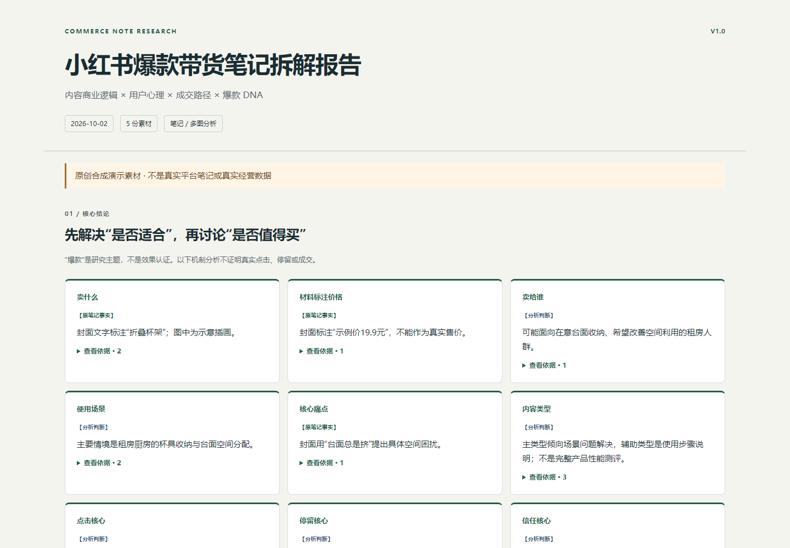

# Xiaohongshu Viral Commerce Note Analyzer

> 丢一篇小红书带货笔记截图进去，自动拆解标题、封面、内容、流量、停留、信任、成交假设与爆款 DNA，并生成可离线阅读的 HTML 分析报告。

**无需 API Key · 无需 Cookie · 无需登录小红书 · 无需 TikHub · 无需第三方付费数据接口**

**上传素材 → 说“拆一下” → 看核心结论 → 打开 HTML 报告。**

这是给支持看图、文件生成和 Agent Skills 的 AI 工具使用的 Skill，不是独立网站。分析使用宿主模型能力；宿主订阅/额度按其规则执行。项目不抓取小红书链接，也不认证某篇内容一定是爆款。



## 核心功能

- 动态范围：标题、封面、文字内容、完整截图、多图和素材片段分别处理。
- 分析具体的点击、继续阅读、建立信任、商品兴趣和购买考虑机制。
- 看清产品何时出现、铺垫什么、承担什么商业任务，而非只总结文章。
- 提炼可迁移DNA、3～5个值得学的点及不能直接照搬的部分。
- 结论标记【原笔记事实】【分析判断】【复刻建议】，可展开查看材料依据。
- 原生视觉看图；不安装OCR，不自动生成仿写包。

## 适合谁

研究带货内容的电商运营、内容策划、商家与创作者。适合拆单篇与同篇多图；不适合批量抓账号数据或证明真实销售效果。

## 支持输入

封面、长截图、多张连续截图、标题、正文、商品介绍、评论样本、商品/数据截图及组合。无需严格格式；模糊数字不猜，不强求缺失材料。仅有链接时会请求截图或文本，不自动访问。

## 输出报告

聊天先给核心结论；完整HTML包含适用的概览、内容路径、封面左图右分析、图片任务、正文与植入、商业机制、DNA、学习点和边界。原图可用时以安全data URI嵌入，拿走一个HTML即可离线阅读；有打印样式，可从浏览器保存PDF。

只给标题时不补封面，只给封面时不猜正文；非带货内容不强行构建成交路径。截图中的宣称不等于独立核验的事实。

## 安装方式

### Codex

已检查当前Codex的 `skill-installer`：支持从GitHub仓库指定目录安装。本项目将SKILL.md放在仓库根目录，安装时根路径为 `.`，名称为 `xiaohongshu-viral-commerce-note-analyzer`。

在Codex中说：

> 请帮我安装这个 Skill：https://github.com/RZ866/xhs-note-breakdown-skill 。SKILL.md 在仓库根目录，请安装整个目录，名称为 xiaohongshu-viral-commerce-note-analyzer。

由Codex内部调用自带安装器，无需你运行命令。当前安装器会拒绝覆盖已有同名目录；更新时请让宿主先检查旧版并完成安全替换，不能把失败当成功。安装成功后下一轮对话可用。

也可以把发布ZIP交给支持本地Skill安装的工具，要求安装整个文件夹；不要只复制SKILL.md。

### WorkBuddy 与其他工具

需要宿主支持Agent Skills、读取上传图片和生成本地文件。可向宿主提供仓库链接或安装包并要求安装；**本项目尚未完成WorkBuddy实机安装验收，不保证所有版本支持相同安装入口。** 如果该宿主不支持GitHub链接安装，使用它实际提供的本地Skill导入功能；没有导入功能则不能宣称已安装。

安装验证：2026-10-03已通过官方安装器从本仓库真实下载、解压并安装到隔离测试目录；另已通过离线包测试。此结果不等于所有宿主都已完成实机验收。规范与验证边界见 [规范核查](references/compatibility.md)。

## 使用方法

上传素材后任选一句：

1. “拆一下。”
2. “这个封面为什么吸引人？”
3. “看看产品怎么植入的。”
4. “这篇值得学什么？”
5. “拆一下带货逻辑。”
6. “看看这个为什么可能卖得动。”

明确调用本Skill后，只上传素材也可以开始。默认不产生仿写；拆解后若需要创作，可继续要求“把这个DNA迁移到我的商品”，并提供自己的真实产品信息。

## 示例

全部为本项目原创合成材料，无真实用户图片、账号或商业数据。

- [封面分析说明](examples/cover-analysis-example.md)
- [文字分析说明](examples/text-analysis-example.md)
- [完整笔记分析说明](examples/full-note-analysis-example.md)
- [完整示例HTML](examples/reports/full/xiaohongshu-analysis-report.html)：下载后用浏览器打开；GitHub代码页不直接渲染HTML。

## 项目结构

```text
SKILL.md                   宿主触发与执行规则
agents/openai.yaml         Codex展示信息
references/                分析框架、报告契约、兼容性与测试结果
scripts/                   离线HTML渲染与发布包检查
assets/                    HTML模板与原创预览图
examples/                  原创素材、结构化分析和HTML示例
tests/                     单元测试、浏览器检查及测试样例
```

## 当前限制

模型需支持视觉才能分析图片；脚本只渲染宿主分析，不会自己理解图像。标准生成器使用Python 3.10+标准库，宿主应内部调用已有运行时；不具备执行能力但能写文件时可按模板生成，无法写文件时不能交付HTML。

图片嵌入支持PNG/JPEG/WebP，每张12MiB、总计40MiB；超限或不可读取时退化为图片编号，不伪造图像。报告包含用户原图时应按原素材隐私级别保存，不自动公开。长截图、小字、遮挡和模糊内容可能识别不足。

缺少后台数据时只能解释可能机制；无证据不能确认真实流量来源、停留、销量归因或转化率。测试证明规则与生成链路符合约束，不保证模型在所有真实材料上都准确。

## Roadmap

- V1.1：将DNA迁移到自己的商品，增加真实卖点和证据约束下的原创创作。
- V1.2：多篇笔记横向比较，区分共同结构与偶然相似。
- V2.0：用户授权的本地案例库，沉淀模型与验证结果。

## 开发与测试

运行时零第三方Python依赖。开发者可运行：

```sh
python -m unittest discover -s tests -v
python tests/make_examples.py
python scripts/package_release.py
```

浏览器与官方校验器属于开发测试工具，不要求普通用户安装；详见 [测试说明](tests/test-cases.md) 和 [验收结果](references/test-results.md)。

## Changelog

见 [CHANGELOG.md](CHANGELOG.md)。当前版本1.0.0。

## License

[MIT](LICENSE)。代码、演示文案和插画由本项目原创；不包含第三方笔记作品。宿主软件及开发工具分别遵守自身许可。
